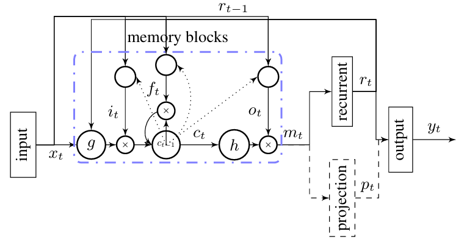
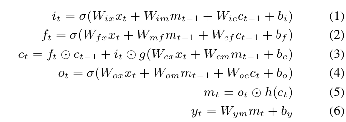

# LSTM

LSTM have cycles feeding the activations from previous time steps as input to the network to make a decistion for the current input.LSTM stores indefinite contextual information, instead fixed information.So LSTM apply dynamic contextual windows.
LSTM is designed for vanishing gradient descent whici limits the capability of RNNs to model the long range context dependencies to 5-10 discrete time steps between relevant input signals and output. 

## Archetechture
LSTM contained special units called memory blocks,which includes memory cells with self-connections storing the temporal state of the network,and special multiplicative units called gates which controls the flow of information. Overview of LSTM archetechture below. 

### Memory Block  
An `INPUT GATE` controls the flow of input activation into the memory cell and An ` OUPUT GATE` controls the flow of cell activations into the rest of the network. An `FORGET GATE` is for preventing LSTM models from processing continuous input stream that is not split into several subsequences. The FORGET GATE is at the beginner of subsesquences to reset the state.Usually FORGET GATE scales the internal state of the cell before adding it to the beginner of cell so that it can adaptively forget or reset cell's memory. 

## Functions
A LSTM network maps inputs x1, x2, ..., xn to outputs y1, y2, ..., yn by calculating followed functions. 
